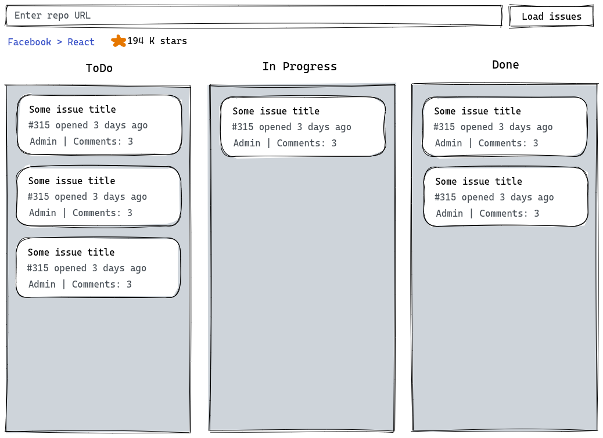

# Github Kanban Board

Implement GitHub repo issues viewer as a kanban board

## Requirements
1. User should enter repo URL in the input on top of the page and press "Load". For example: `https://github.com/facebook/react`.
2. App loads issues for the repo using Github API.
3. App contains 3 columns:
- ToDo (all new issues)
- In Progress (opened issues with assignee)
- Done (closed issues)

4. User should be able to drag-n-drop between the columns and change the order of issues.
5. Current issue position (column and order) should be stored between search and browser sessions. When the user loads issues for Repo1 -> Repo2 -> Repo1 he should see all changes he did for Repo1.
6. User should be able to visit the profile of the owner of the repo and visit the repo as well by links under the input.

## Technologies

You should use exactly the listed technologies or one of them if it is allowed:

- React 18 with hooks, no classes
- Typescript
- UI library (on your choice):
  - Ant Design
  - React-Bootstrap
  - Semantic UI
  - Blueprint UI
  - Chakra UI
- State manager (on your choice):
  - Redux (or Redux-Toolkit)
  - MobX
  - Recoil
  - Zustand
- Testing (on your choice):
  - React Testing Library
  - Cypress
  - Vitest
- any other library you need

## Assessment

What will we assess:
- workability: how your application works
- projects structure: how you structure your files
- code quality: how you write clean, readable code (feel free to install and use ESLint and Prettier)
- knowledge of React and its ecosystem: how you compose and use libraries together
- testing: how you can test your code

> **Note** 
> If you use generative AI to complete the task (partially or completely) it would be nice if you could share your thoughts about motivation, experience, and results of using such AI tools.

## Mockups

## How to complete the task
- create a new public repo on Github
- develop the application according to the requirements
- send us the link to your repo
